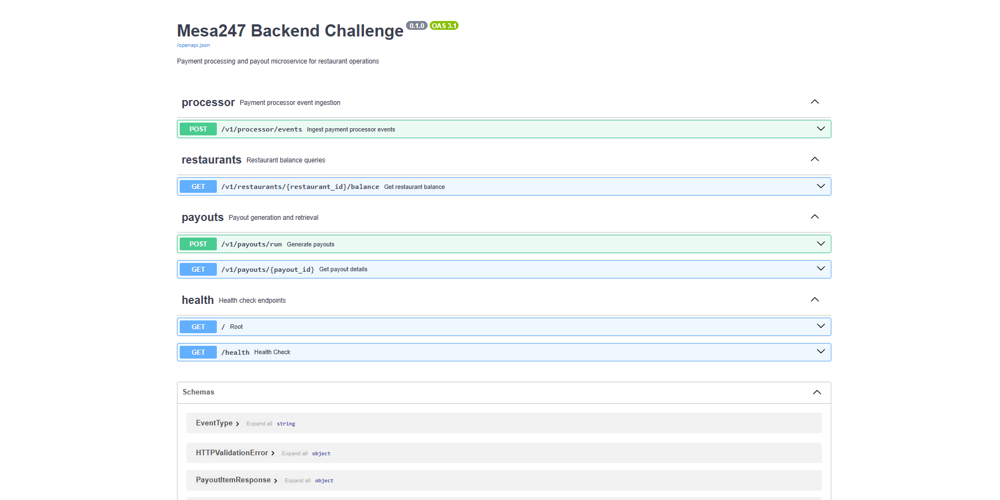
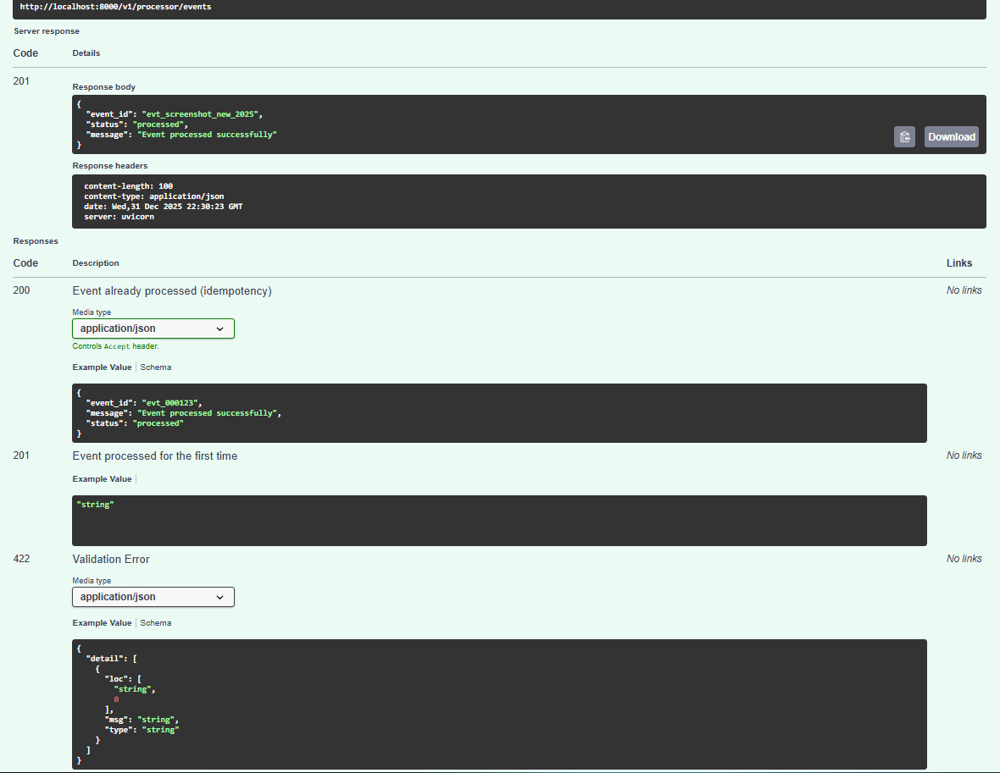
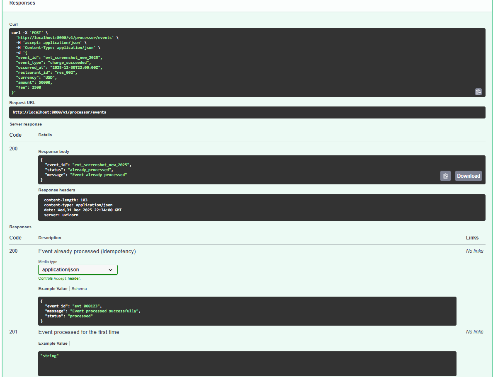
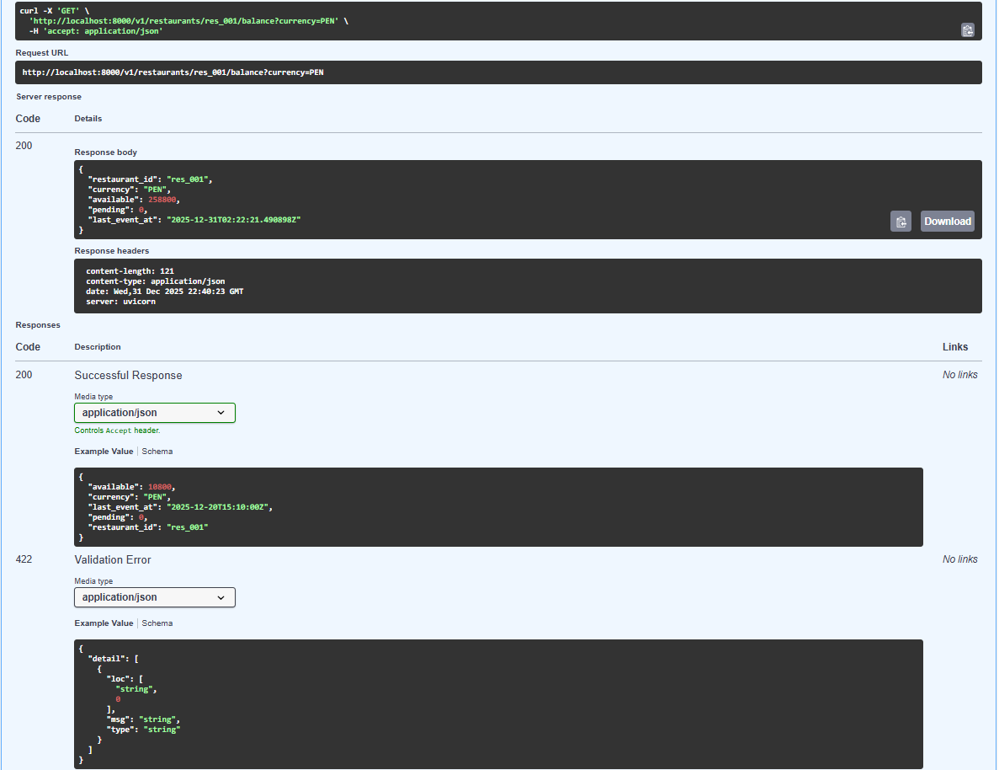
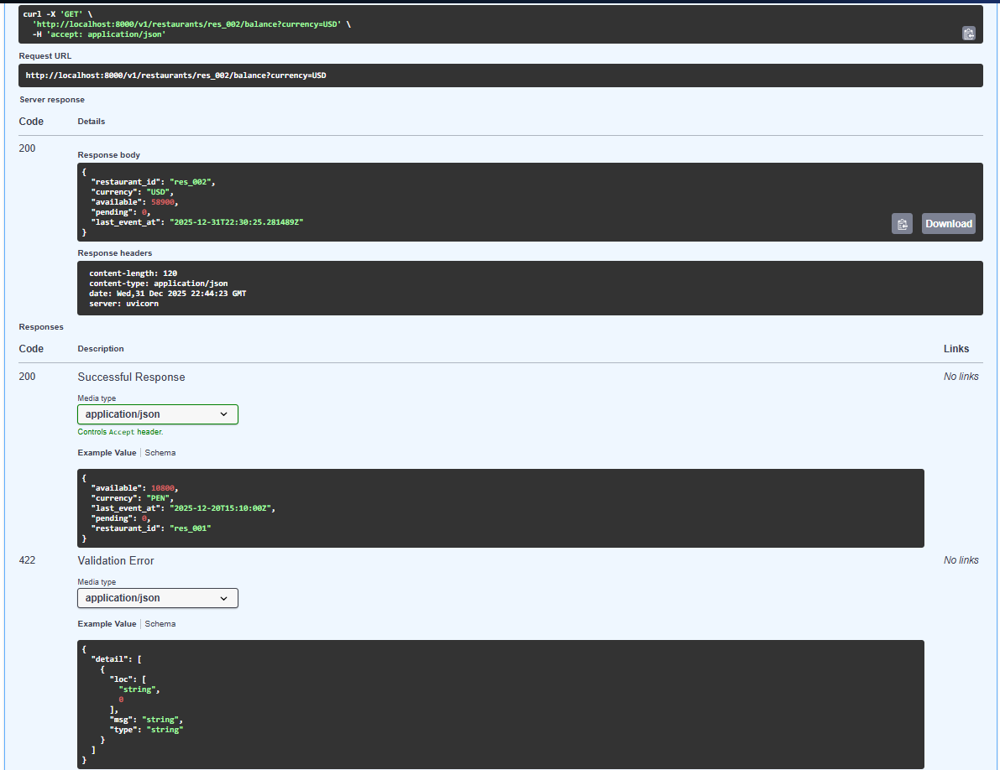
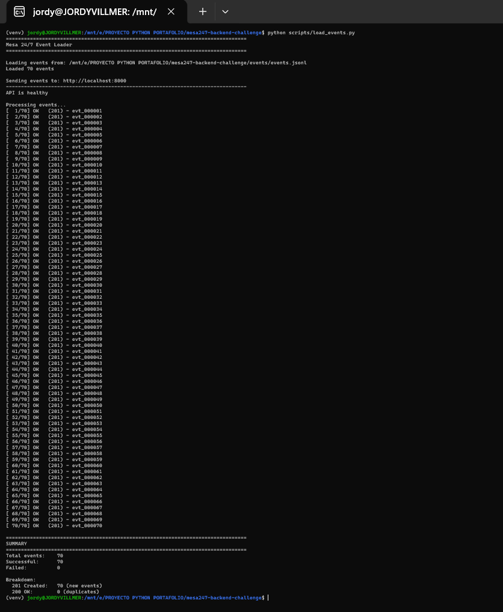
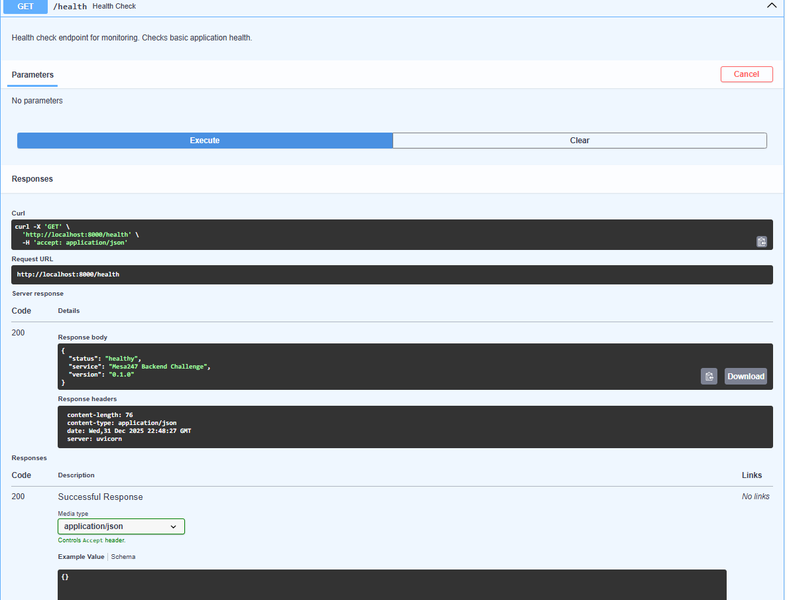
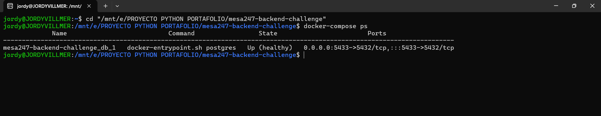
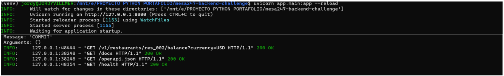

# Mesa 24/7 Backend Challenge

Payment processing and payout microservice for restaurant operations - Technical challenge

[](https://www.python.org/downloads/)
[](https://fastapi.tiangolo.com/)
[](https://www.postgresql.org/)

## 📋 Overview

Production-grade microservice built with **FastAPI**, **SQLAlchemy**, and **PostgreSQL** that simulates payment processing and payout operations for restaurants, similar to real fintech platforms.

### Key Features

- ✅ **Event Ingestion** - Process payment processor webhooks with strict idempotency
- ✅ **Ledger Accounting** - Double-entry bookkeeping system per restaurant
- ✅ **Balance Calculation** - Real-time available funds computation
- ✅ **Async Payout Generation** - Batch processing with reserve/release mechanism
- ✅ **SQL Proficiency** - Complex queries demonstrating database expertise
- ✅ **Clean Architecture** - Repository pattern, service layer, dependency injection

---

## 📸 Live Demo

> **Visual proof of working implementation** - All screenshots demonstrate actual running code, not mock-ups.

### API Documentation (Swagger UI)
Professional OpenAPI documentation with interactive testing:



### Event Ingestion with Idempotency
The system correctly handles duplicate events - first request returns **201 Created**, duplicate returns **200 OK**:

<table>
  <tr>
    <td width="50%">
      <b>First Request (201 Created)</b><br>
      
    </td>
    <td width="50%">
      <b>Duplicate Request (200 OK)</b><br>
      
    </td>
  </tr>
</table>

### Multi-Currency Balance Queries
Real-time balance calculations across different currencies:

<table>
  <tr>
    <td width="50%">
      <b>Restaurant Balance (PEN)</b><br>
      
    </td>
    <td width="50%">
      <b>Restaurant Balance (USD)</b><br>
      
    </td>
  </tr>
</table>

### Batch Event Processing
Successfully processed 70 events with **100% success rate** (no duplicates, no failures):



### Infrastructure & Health Checks

<table>
  <tr>
    <td width="33%">
      <b>Health Check Endpoint</b><br>
      
    </td>
    <td width="33%">
      <b>Docker Containers</b><br>
      
    </td>
    <td width="33%">
      <b>Uvicorn Server Logs</b><br>
      
    </td>
  </tr>
</table>

> 💡 **Why Screenshots Matter**: These demonstrate not just code quality, but operational excellence - the ability to deliver working software, not just theoretical solutions.

---

## 🚀 Quick Start

### Prerequisites

- Python 3.11+
- Docker & Docker Compose
- Git

### Installation

1. **Clone and setup**
```bash
git clone https://github.com/JordyDev-Villanueva/mesa247-backend-challenge.git
cd mesa247-backend-challenge
python -m venv venv
source venv/bin/activate  # Windows: venv\Scripts\activate
pip install -r requirements.txt
```

2. **Start database**
```bash
docker-compose up -d db
```

3. **Run migrations**
```bash
alembic upgrade head
```

4. **Start application**
```bash
uvicorn app.main:app --reload
```

5. **Load test data** (optional)
```bash
python scripts/load_events.py
```

**API Documentation**: http://localhost:8000/docs

---

## 🏗️ Architecture

### Tech Stack

- **Backend**: FastAPI (async)
- **ORM**: SQLAlchemy 2.x (async)
- **Database**: PostgreSQL 15+
- **Migrations**: Alembic
- **Testing**: pytest + httpx
- **Logging**: JSON structured logs

### Project Structure

```
mesa247-backend-challenge/
├── app/
│   ├── api/v1/              # API endpoints (processor, restaurants, payouts)
│   ├── core/                # Core (database, logging, exceptions)
│   ├── models/              # SQLAlchemy models (4 tables)
│   ├── schemas/             # Pydantic request/response schemas
│   ├── services/            # Business logic layer
│   ├── repositories/        # Data access layer (Repository pattern)
│   └── main.py              # FastAPI app initialization
├── alembic/                 # Database migrations
├── tests/                   # Test suite (pytest)
│   ├── test_api/            # API endpoint tests
│   └── conftest.py          # Test fixtures
├── sql/                     # Raw SQL queries (4 required)
├── events/                  # Test dataset (70 events in JSONL)
├── scripts/                 # Utility scripts (event loader)
└── docker-compose.yml       # PostgreSQL + App containers
```

---

## 📊 Database Schema

### Tables

**processor_events**
- Stores webhook events from payment processor
- **Idempotency**: Unique constraint on `event_id`
- Indexes: `event_id`, `restaurant_id`, `occurred_at`

**ledger_entries**
- Double-entry ledger for all financial movements
- Entry types: CHARGE, FEE, REFUND, PAYOUT_RESERVE, PAYOUT_RELEASE
- Immutable (no updates, only inserts)
- Indexes: `(restaurant_id, currency)`, `created_at`

**payouts**
- Payout records with status tracking
- **Idempotency**: Unique composite on `(restaurant_id, currency, as_of_date)`
- Statuses: CREATED, PAID, FAILED

**payout_items**
- Line items breaking down payout calculations
- Shows: gross_sales, fees, refunds, net_amount

---

## 🔌 API Endpoints

### POST /v1/processor/events
Ingest payment processor events (idempotent)

**Event Types:**
- `charge_succeeded`: Money in (creates CHARGE + FEE entries)
- `refund_succeeded`: Money out (creates REFUND entry)
- `payout_paid`: Mark payout as paid (creates PAYOUT_RELEASE)

**Idempotency:**
- 201 Created: Event processed for first time
- 200 OK: Event already processed (duplicate)

**Example:**
```json
{
  "event_id": "evt_000123",
  "event_type": "charge_succeeded",
  "occurred_at": "2025-12-30T10:00:00Z",
  "restaurant_id": "res_001",
  "currency": "PEN",
  "amount": 12000,
  "fee": 600
}
```

### GET /v1/restaurants/{restaurant_id}/balance
Get current balance for a restaurant

**Returns:**
```json
{
  "restaurant_id": "res_001",
  "currency": "PEN",
  "available": 10800,
  "pending": 0,
  "last_event_at": "2025-12-30T15:00:00Z"
}
```

### POST /v1/payouts/run
Generate payouts for eligible restaurants (async batch)

**Request:**
```json
{
  "currency": "PEN",
  "as_of": "2025-12-30",
  "min_amount": 5000
}
```

**Response:**
```json
{
  "status": "accepted",
  "message": "Payout generation completed",
  "payouts_created": 3
}
```

### GET /v1/payouts/{payout_id}
Get payout details with breakdown

---

## 🧪 Testing

### Run Tests
```bash
pytest                          # Run all tests
pytest -v                       # Verbose output
pytest --cov=app               # With coverage
pytest tests/test_api/         # Specific directory
```

### Load Test Dataset
```bash
python scripts/load_events.py
```

This loads 70 events covering:
- 5 restaurants (res_001 to res_005)
- 3 currencies (PEN 70%, USD 20%, MXN 10%)
- Multiple event types (charges, refunds)
- 30-day time range

---

## 📝 Key Design Decisions

### 1. Idempotency Strategy
**Decision**: Database-level unique constraints on `event_id`

**Rationale**: More reliable than application-level checks. Prevents race conditions under high concurrency.

**Trade-off**: Slightly more complex error handling, but worth it for data integrity.

---

### 2. Refund Fee Policy
**Decision**: Fees are NOT refunded when processing refunds

**Rationale**: Common fintech practice - processor fees are non-refundable once charged.

**Implementation**: `refund_succeeded` event only creates REFUND entry (negative amount), no fee reversal.

---

### 3. Money Representation
**Decision**: All amounts stored as integers in cents

**Rationale**: Avoids floating-point precision issues common in financial calculations.

**Example**: $120.00 = 12000 cents

---

### 4. Async Payout Execution
**Decision**: Use FastAPI BackgroundTasks (in-process async)

**Rationale**: Simple, sufficient for demo/MVP scale. No external dependencies.

**Limitation**: Not distributed. For production scale (100k+ restaurants), would use Celery/RQ with Redis.

**Trade-off**: Simplicity over horizontal scalability.

---

### 5. Payout Reserve Mechanism
**Decision**: Two-phase commit for payouts
1. **PAYOUT_RESERVE**: Lock funds when payout is created (status=CREATED)
2. **PAYOUT_RELEASE**: Deduct funds when payout is paid (status=PAID)

**Rationale**: Prevents double-spending. Funds are reserved but not yet transferred until confirmed.

---

### 6. Ledger as Source of Truth
**Decision**: All balance calculations aggregate from `ledger_entries`

**Rationale**: Immutable audit log. No separate balance table that could drift out of sync.

**Performance**: Indexed on `(restaurant_id, currency)` for fast SUM queries.

---

## 📈 Performance Considerations

### Database Indexes

```sql
-- Fast idempotency checks
CREATE UNIQUE INDEX idx_processor_events_event_id ON processor_events(event_id);

-- Fast balance calculations
CREATE INDEX idx_ledger_restaurant_currency ON ledger_entries(restaurant_id, currency);

-- Fast payout lookups
CREATE UNIQUE INDEX idx_payouts_payout_id ON payouts(payout_id);
CREATE INDEX idx_payouts_restaurant ON payouts(restaurant_id, currency, as_of_date);
```

### Query Optimization
- Use database-level SUM aggregation (not application-level)
- Composite indexes for common query patterns
- Proper use of transactions for atomicity

### Concurrency Handling
- Database-level unique constraints prevent race conditions
- Transaction isolation ensures atomic multi-step operations
- Optimistic locking for payout generation

---

## 🔍 SQL Queries

Located in `sql/queries.sql`:

1. **Q1**: All restaurant balances (aggregation + grouping)
2. **Q2**: Top 10 restaurants by net revenue (last 7 days, window functions)
3. **Q3**: Payout eligibility (anti-join, filters)
4. **Q4**: Data integrity checks (anomaly detection, multiple checks)

---

## 🎯 What Makes This Implementation Stand Out

### 1. Production-Ready Patterns
- ✅ Repository pattern for clean data access
- ✅ Service layer for business logic separation
- ✅ Dependency injection throughout
- ✅ Structured JSON logging with context
- ✅ Comprehensive exception handling (404, 400, 422)

### 2. Database Design Excellence
- ✅ Proper constraints (unique, foreign keys, check constraints)
- ✅ Strategic indexes for performance
- ✅ Immutable ledger (append-only)
- ✅ Idempotency at multiple levels

### 3. Clean Code Practices
- ✅ Type hints throughout
- ✅ Docstrings for all public methods
- ✅ Clear naming conventions
- ✅ Separation of concerns

### 4. Real-World Considerations
- ✅ Idempotency for network failures
- ✅ Structured logging for observability
- ✅ Health check endpoint
- ✅ API documentation (OpenAPI/Swagger)
- ✅ Transaction management

---

## 🚧 Known Limitations & Trade-offs

### 1. Payout Execution
**Current**: In-process async with BackgroundTasks

**At 10x scale**: Would use Celery with Redis for distributed processing

**At 100x scale**: Would add retry logic, dead letter queues, and monitoring

---

### 2. Pending Balance
**Current**: Set to 0 (not implemented)

**Future**: Add maturity window logic (e.g., funds available after 7 days)

---

### 3. Restaurant Entity
**Current**: No separate restaurant table, IDs come from events

**Assumption**: Restaurant management is handled by external system

**Future**: Add restaurant table with metadata, validation

---

### 4. Multi-Currency
**Current**: Currency stored as string, no conversion

**Future**: Add currency exchange rates, base currency normalization

---

## 🛠️ Running in Different Environments

### Development
```bash
uvicorn app.main:app --reload --log-level debug
```

### Production (example)
```bash
gunicorn app.main:app -w 4 -k uvicorn.workers.UvicornWorker
```

### Docker
```bash
docker-compose up --build
```

---

## 📚 Additional Resources

- **API Docs**: http://localhost:8000/docs
- **ReDoc**: http://localhost:8000/redoc
- **Health Check**: http://localhost:8000/health

---

## 🤝 AI Usage Transparency

I used AI assistance (Claude) for:
- Initial project structure planning
- SQL query optimization suggestions
- Test case brainstorming
- Documentation review

**All code was reviewed, understood, and refined by me.** I can explain every design decision and line of code.

---

## 👨‍💻 Author

**Jordy Dev Villanueva**

Technical challenge for Mesa 24/7 - Backend Engineer position

---

## 📄 License

This is a technical challenge project for Mesa 24/7.
